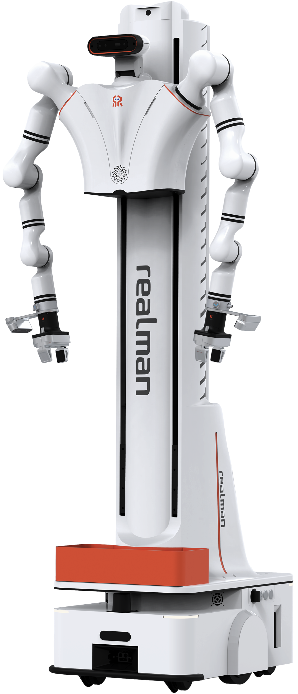
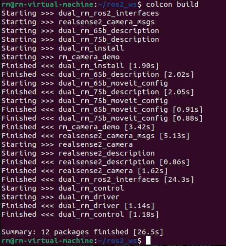
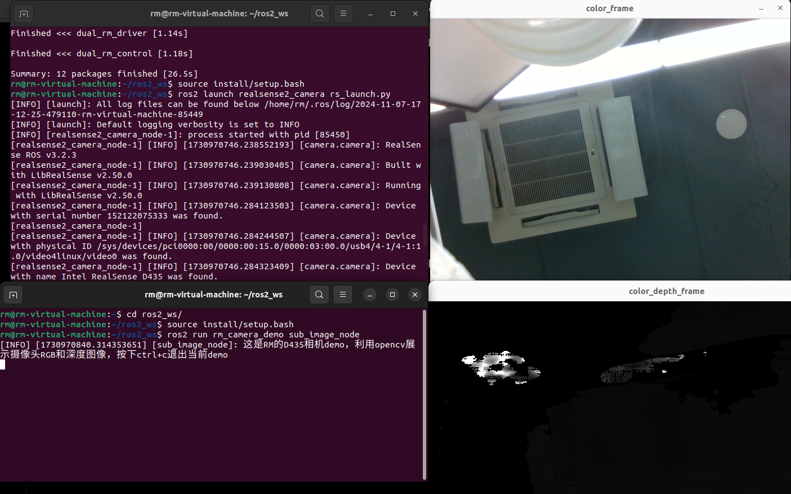

<div align="left">
[中文简体](./README_CN.md)|
[English](./README.md)

# rmc_aida_l_ros2



该功能包的主要作用为RM具身双臂升降机器人提供ROS2支持，以下为使用环境。

* 支持的机械臂控制器版本1.6.5以上。
* 基于的Ubuntu版本为20.04。
* ROS2版本为foxy。

| 具身双臂升降机器人（6轴）                                    |                                                     |                                                              |
| ------------------------------------------------------------ | --------------------------------------------------- | ------------------------------------------------------------ |
| 部件名称                                                     | 硬件版本信息                                        | 软件版本信息                                                 |
| 机械臂                                                       | RM75-B                                              | 控制器V1.6.5及以上，API V4.2.8及以上，ROS2功能包V1.0.1       |
| 相机                                                         | Realsense D435C                                     | ros2_realsense2                                              |
| 主控                                                         | jetson xavier NX                                    | ubuntu20.04 、ros-foxy                                       |
| 底盘                                                         | woosh                                               | API版本0.10.8，socket通信                                    |
| 头部电机/升降机                                              | WHJ30-80关节                                        | 作为机械臂的扩展轴使用，头部关节连接在右臂上作为扩展关节，升降连接在左臂上作为扩展关节 |
| 末端工具（可选）                                             | EG2-4C2夹爪/灵巧手（右手RM56DFX-2R/左手RM56DFX-2L） | 与机械臂API和ROS包集成                                       |
| 语音模块                                                     | 轮趣 M240麦克风阵列                                 | 语音模块资料V5.1（https://pan.baidu.com/e/1nVS8SXqZWn5scmidNqWb7w?_at_=1724069216106） |
| 更多信息参考：https://develop.realman-robotics.com/robot/versionComparisonTable.html ROS包下载：https://github.com/RealManRobot |                                                     |                                                              |

如果为机器人机械臂为RM65-B，则将[ros2_rm_robot/dual_rm_driver/config/dual_left_config.yaml](./ros2_rm_robot/dual_rm_driver/config/dual_left_config.yaml)和[ros2_rm_robot/dual_rm_driver/config/dual_right_config.yaml](./ros2_rm_robot/dual_rm_driver/config/dual_right_config.yaml)中的 arm_type、 arm_dof参数7改为6，arm_joints参数删除joint7。

机器人话题服务功能详情见[具身双臂升降ROS2话题服务功能列表](./具身双臂升降ROS2话题服务功能列表.md)|

下面为功能包安装使用教程。

## 1.搭建环境
---
在使用功能包之前我们首先需要进行如下操作。
* 1.[安装ROS2](#安装ROS2)
* 2.[安装Moveit2](#安装Moveit2)
* 3.[配置功能包环境](#配置功能包环境)
* 4.[编译](#编译)
### 安装ROS2
----
我们提供了ROS2的安装脚本`ros2_install.sh`，该脚本位于`ros2_rm_robot\dual_rm_install`功能包中的`scripts`文件夹下，在实际使用时我们需要移动到该路径执行如下指令。
```
sudo bash ros2_install.sh
```
如果不想使用脚本安装也可以参考网址 [ROS2_INSTALL](https://docs.ros.org/en/foxy/Installation/Ubuntu-Install-Debians.html)。
### 安装Moveit2
----
我们提供了Moveit2的安装脚本`moveit2_install.sh`，该脚本位于`ros2_rm_robot\dual_rm_install`功能包中的`scripts`文件夹下，在实际使用时我们需要移动到该路径执行如下指令。
```bash
sudo bash moveit2_install.sh
```
如果不想使用脚本安装也可以参考网址 [Moveit2_INSTALL](https://moveit.ros.org/install-moveit2/binary/)进行安装。
### 配置功能包环境
----
该脚本位于`ros2_rm_robot\dual_rm_driver`功能包中的`lib`文件夹下，在实际使用时我们需要移动到该路径执行如下指令。
```
sudo bash lib_install.sh
```
----
安装底盘ros2接口安装包
在~/ros2_agv_robot/lib路径下执行
```bash
sudo ./ros-foxy-woosh-robot-agent_0.0.1-0focal_arm64.run
```

### 编译
----
以上执行成功后，可以执行如下指令进行功能包编译，首先需要构建工作空间，并将功能包文件导入工作空间下的`src`文件夹下，之后使用`colcon build`指令进行编译。
```
mkdir -p ~/ros2_ws/src
cp -r rm_dual_arm_lifting_robot_ros2 ~/ros2_ws/src
cd ~/ros2_ws
colcon build --packages-select rm_ros_interfaces
colcon build --packages-select realsense2_camera_msgs
source ./install/setup.bash
colcon build
```


编译完成后即可进行功能包的运行操作。

moveit配置详见[具身双臂升降ROS2-foxy-moveit2配置教程](./具身双臂升降ROS2-foxy-moveit2配置教程.pdf)|

## 2.功能运行
---
功能包简介：功能包中包含具身双臂升降机器人ROS2的实例控制，用户可完成具身双臂升降机器人的ROS2操作。为方便移植，将具身双臂升降机器人各部件单独拆分，形成独立的功能包，方便功能包的复用和组装使用。

注意：符合具身双臂升降机器人的升降模块接到了左臂的升降机构上，头部的转动接到了右臂的拓展关节上。

## 2.1各部件demo

### 2.1.1底盘demo

### 2.1.2相机demo

相机demo位于ros2_realsense2文件夹，demo包（rm_camera_demo）测试时需要先启动realsense2_camera的相机节点，命令如下。

```
source ~/ros2_ws/install/setup.bash
ros2 launch  realsense2_camera  rs_launch.py
```

注：原始相机节点启动命令为ros2 launch  realsense2_camera  rs_launch.py，若需要使用深度对齐RGB的图像，则需要在后面加上参数以获取对齐的图像话题。

启动可视化D435图像的demo，命令如下。

```
ros2 run rm_camera_demo sub_image_node 
```



启动获取图像中心点坐标值的demo，命令如下。

```
ros2 run rm_camera_demo Center_Coordinate_node
```

若想查看相机的点云信息，可以使用相机驱动包自带的demo示例，命令如下。

```bash
source ~/ros2_ws/install/setup.bash
ros2 launch  realsense2_camera  demo_pointcloud_launch.py 
```

打开第一个rgb相机
```bash
source ~/ros2_ws/install/setup.bash
ros2 run rm_camera_demo camera_0_node 
ros2 run ros2_toal_demo camera_0.py
```

打开第二个rgb相机
```bash
source ~/ros2_ws/install/setup.bash
ros2 run rm_camera_demo camera_1_node 
ros2 run ros2_toal_demo camera_1.py
```

打开realsense深度相机，运行程序会检测到所有realsense相机，可通过选择设备号打开指定的相机
```bash
source ~/ros2_ws/install/setup.bash
ros2 run rm_camera_demo open_realsense_node 
```


### 2.1.3语音模块demo

### 2.1.4整体联动demo

1.测试Demo

启动驱动程序

```
source ~/ros2_ws/install/setup.bash
ros2 launch ros2_total_demo total_demo.launch.py
```

启动demo节点

```
source ~/ros2_ws/install/setup.bash
ros2 run ros2_total_demo total_demo_node
```

2.视觉抓取Demo（识别物体为饮料瓶）

启动驱动程序

```
source ~/ros2_ws/install/setup.bash
ros2 launch ros2_total_demo start.launch.py
```

注意：启动的相机节点（ros2_total_demo/scripts目录下的detect_object.py脚本）中会打印相机的serial_number，请将正确的serial_number填写到代码中，编译后执行

启动视觉抓取程序（遨意灵巧手）

```
source ~/ros2_ws/install/setup.bash
ros2 run ros2_total_demo catch2object_aoyi_hand.py
```

或

启动视觉抓取程序（两指夹爪）

```
source ~/ros2_ws/install/setup.bash
ros2 run ros2_total_demo catch2object_gripper.py
```

注意：测试Demo和视觉抓取Demo不能同时启动,根据机器人末端执行器选择执行脚本

### 安全提示

----
在使用机械臂时，为保证使用者安全，请参考如下操作规范。
* 每次使用前检查机械臂的安装情况，包括固定螺丝是否松动，机械臂是否存在震动、晃动的情况。
* 机械臂在运行过程中，人不可处于机械臂落下或工作范围内，也不可将其他物体放到机械臂动作的安全范围内。
* 在不使用机械臂时，应将机械臂置于安全位置，防止震动时机械臂跌落而损坏或砸伤其他物体。
* 在不使用机械臂时应及时断开机械臂电源。

### 版本更新

| 修订版本                  | 内容更新                                                                       | 生效日期                       |
| ------------------------ | ------------------------------------------------------------------------------ | ----------------------------- |
| V1.0                     |  首次提交代码                                                                   | 2024-11-11                   |
| V1.1                     |  1.修改了driver无法上报UDP信息BUG 2.增加了机械臂gazebo仿真功能                   | 2024-12-09                    |
| V1.1.1 | 1.完善了整体联动demo 2.修改了urdf中左手安装方向bug 3.优化了相机代码 | 2024-12-12 |
| V1.1.2 | 1.增加了视觉抓取Demo | 2024-12-24 |
| V1.1.3 | 1.增加了悟时底盘功能包 | 2025-01-02 |


### 常见问题
1. 执行:sudo bash ros2_install.sh
报错：invalid option line 7: set: -
解决方法：dos2unix ros2_install.sh
